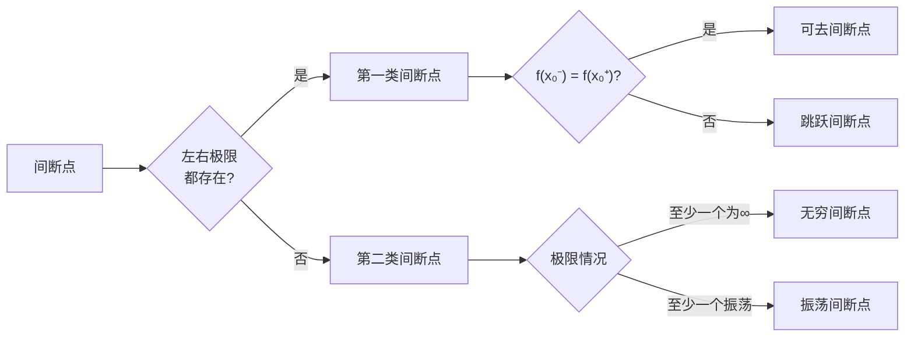

# 高数一

## 一、基础函数

### p1 基础函数定义

#### **1. 一次函数**

> 形式：kx + b
> 图像：
#### **2. 二次函数**

> 形式：y = ax² + bx + c
> 图像：

#### **3. 反比例函数**

> 形式：y = k / x
> 图像：

#### **4. 指数函数**

> 形式：y = a^x
> 图像：
> 
> 	*0 < a < 1*
> 
> 	
> 	*a >= 1*
> 

#### **5. 对数函数**

> 形式：y = log_a( x )
> 图像：
> 
> 	*0 < a <1*
> 
> 
> 	*a >= 1*
> 

#### **6. 幂函数**

> 形式：y = x^a
> 图像：
> 
> 	a > 0
> 
> 
> 	a < 0
> 
> 
> 	a为分数
> 

#### **7. 三角函数**

> 形式：y = sin/cos/tan/cot x
> 图像：
> 
> 	sin x
> 
> 
	cos x
> 
> 
> 	tan x
> 
> 
> cot x
> 
> 一定要记下来：
> sin90° = 0
> cos90° = 1

#### **8. 反三角函数**

> 形式：y = arcsin/arccos/arctan/arttan x
> 图像：
> 
> 	arcsin x
> 
> 
> 	arccos x
> 
> 
> 	arctan x
> 
> 

### p2 运算

#### 1. **次方根**的四则运算

*加减：**无***
*乘法：*
*除法：
次方：

#### 2. **对数**的四则运算

*加法：
*减法：
*乘法：**无***
*除法：
次方：无
特殊：

#### 3. **三角函数**的四则运算与换算

##### 1. 平方和公式

- sin²α + cos²α = 1
##### 2. 两角和差

- sin(α±β) = sinα cosβ ± cosα sinβ
- cos(α±β) = cosα cosβ ∓ sinα sinβ
- tan(α±β) = 
##### 3. 二倍角

- sin2α = 2 sinα cosα
- cos2α = cos²α - sin²α 
		= 2cos²α - 1 
		= 1 - 2sin²α
- tan2α = 
##### 4. 除法

- tanα = sinα / cosα
- cotα = cosα / sinα

## 二、极限

### p1 无穷小的比较

**“高0低无穷同c等1，k阶看幂次”**
#### 1. 高阶无穷小 —— β(x)=o(α(x))
$$
\lim_{x \to x_0} \frac{\beta(x)}{\alpha(x)} = 0 \quad
$$
#### 2. 低阶无穷小
$$
\lim_{x \to x_0} \frac{\beta(x)}{\alpha(x)} = \infty
$$
#### 3. 同阶无穷小
$$
\lim_{x \to x_0} \frac{\beta(x)}{\alpha(x)} = c \ne 0
$$
#### 4. 等价无穷小 —— α(x)∼β(x)
$$
\lim_{x \to x_0} \frac{\beta(x)}{\alpha(x)} = 1 \quad
$$
#### 5. k阶无穷小
$$
\lim_{x \to x_0} \frac{\beta(x)}{[\alpha(x)]^k} = c \ne 0 \quad (k > 0)
$$

### p2 求极限的方法
#### 1. 直接代入
#### 2. 除以分子分母最高项
#### 3. 换算

等价无穷小替换：
$$
\begin{aligned}
&\boxed{x} \sim \boxed{\sin x} \sim \boxed{\tan x} \sim \boxed{\arcsin x} \sim \boxed{\arctan x} \sim \boxed{e^x - 1} \sim \boxed{\ln(1 + x)} \\
&\boxed{1 - \cos x} \sim \boxed{\frac{1}{2}x^2} \\
&\boxed{a^x - 1} \sim \boxed{x \ln a} \quad (a > 0, a \ne 1) \\
&\boxed{(1 + x)^a - 1} \sim \boxed{ax} \quad (a \ne 0)
\end{aligned}
$$

两个重要极限：
$$
\lim_{x \to \infty} \left( 1 + \frac{k}{x} \right)^{x} = e^k

\lim_{x \to 0} (1 + x)^{\frac{k}{x}} = e^k
$$

### p3 运算： 四则运算和通常的一样

### p4 求渐近线
#### 1. 水平渐近线
	x接近无穷，求极限
#### 2. 垂直渐近线
	分母=0

### p5 间断点

### p6 连续（如何证明）
#### **第一步：检查定义**

- 计算 f(a)（代入x=a）
- 如果 f(a) 不存在，**不连续**！

#### **第二步：求极限**

- 计算 左右极限
    
- 如果极限不存在（如左右极限不等或震荡），**不连续**！
- 如果和f(a)不等，**不连续**！

## 三、导数

### p1 基本定义

#### 1. 如何求导

定义式：
$$
f'(x_0) = \lim_{\Delta x \to 0} \frac{f(x_0 + \Delta x) - f(x_0)}{\Delta x}
$$

定义式变体：
$$
\lim_{\Delta x \to 0} \frac{f(x_0 + a \Delta x) - f(x_0 + b \Delta x)}{c \Delta x} = \frac{a-b}{c} \cdot f'(x_0)
$$

增量式：
$$
f'(x_0) = \lim_{x \to x_0} \frac{f(x) - f(x_0)}{x - x_0}
$$

#### 2. 如何判断函数是否可导

1. 判断**是否连续**（函数值=左极限=右极限 且都存在）
2. 判断是否**左导=右导**

### p2 四则运算

	令可导函数“U”、“V”
1. 加减：**( U ± V )' = U' ± V'**
2. 乘法：**( U * V )' = U'V + UV'**
3. 除法：**( U / V )' = (U'V - UV') / V²**

### p3 各类函数求导公式
#### 1. 基础函数
	

